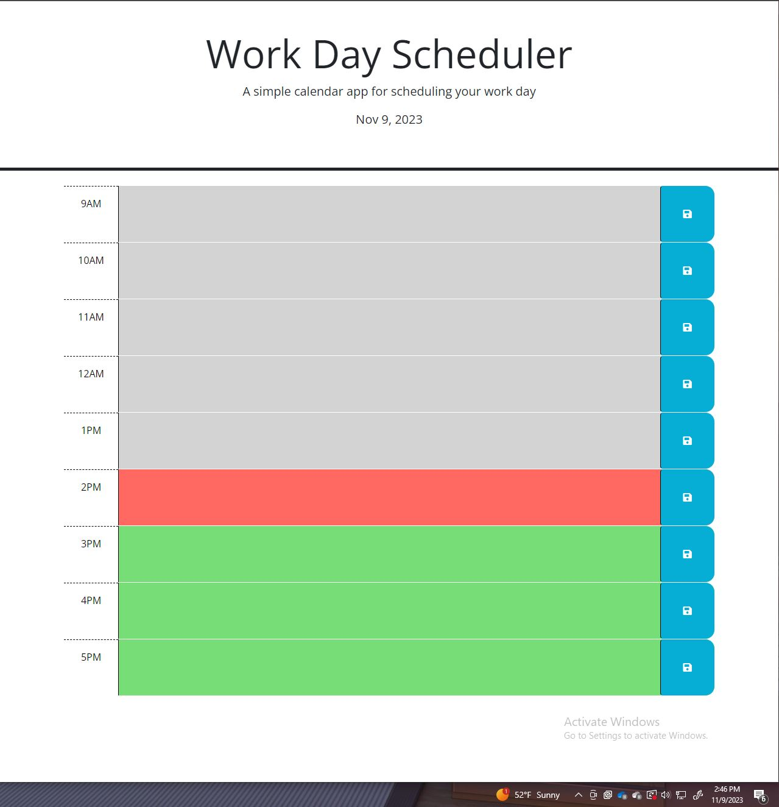

# Challenge 5

## Acceptance Criteria

```
GIVEN I am using a daily planner to create a schedule
WHEN I open the planner
THEN the current day is displayed at the top of the calendar
WHEN I scroll down
THEN I am presented with timeblocks for standard business hours of 9am&ndash;5pm
WHEN I view the timeblocks for that day
THEN each timeblock is color coded to indicate whether it is in the past, present, or future
WHEN I click into a timeblock
THEN I can enter an event
WHEN I click the save button for that timeblock
THEN the text for that event is saved in local storage
WHEN I refresh the page
THEN the saved events persist
```

## Photo of Website Functionality
The following Photo shows the web application's appearance and functionality:




# Explanation of what was done

Made a todo list that changes colors based on the time!
(EX. if its 5pm everything before it will be gray, the 5pm block will be red and everything after will be green.)

You can write and save your todos to view them at a later time!
